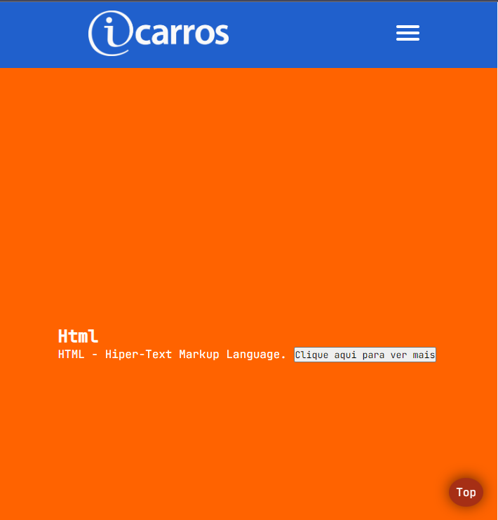
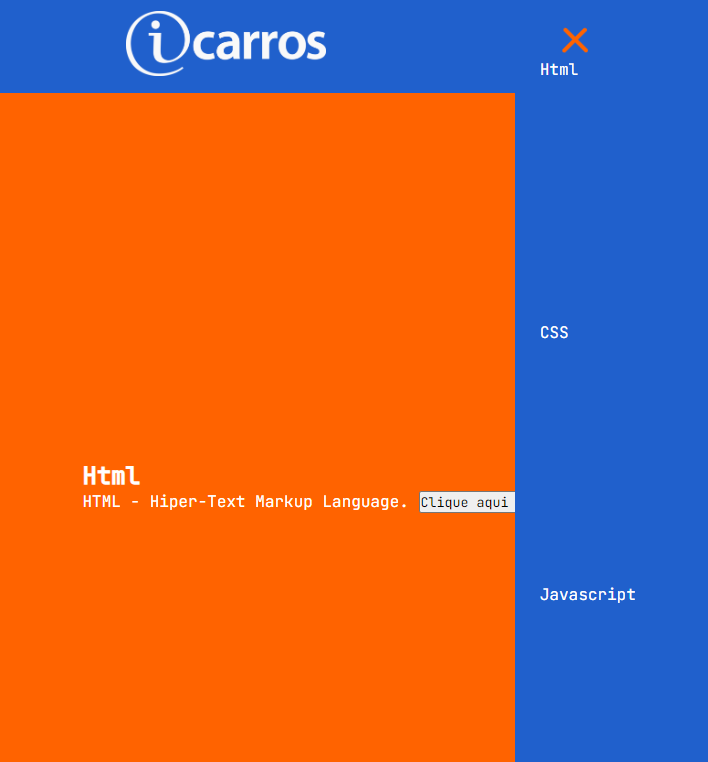

# <"acelera"><"iCarros_Tech"> - Gama Academy

O objetivo desse projeto foi colocar em prática os conhecimentos adquiridos durante as aulas síncronas e assíncronas do Acelera Tech iCarros, feitos em parceria de [Gama Academy](https://www.gama.academy/) e o [iCarros](https://www.icarros.com.br/principal/index.jsp).

## Tecnologias utilizadas

- HTML.
  
- CSS.
  
- JavaScript.
  
## Introdução

O projeto foi feito durante as aulas para ter um estilo que lembre o próprio site do [iCarros](https://www.icarros.com.br/principal/index.jsp).

Até o momento utilizando conceitos básicos de html, css e javascript, dando importâncias também a semântica do html, metatags de OpenGraph, metatags para os buscadores e integração com o google search console e hotjar.

## Preview do projeto

Site principal com o hamburger menu.

Hamburger menu pressionado.

## Como testar o projeto

### Acessar o site do projeto

O projeto está hospedado no Netilify, podendo ser acessado por esse [link](https://icarros-gama-guilherme-gabriel.netlify.app/).

### Clone o repositório e abra remotamente

Digite no seu terminal

``
git clone https://github.com/guilhermag/icarros-front.git
``

``
cd icaros-front/
``

Agora é só abrir o ``index.html``.

## Créditos

Aulas ministradas pelo professor [Douglas Morais](https://github.com/mrdouglasmorais), e projeto desenvolvido por Guilherme de Araujo Gabriel.
